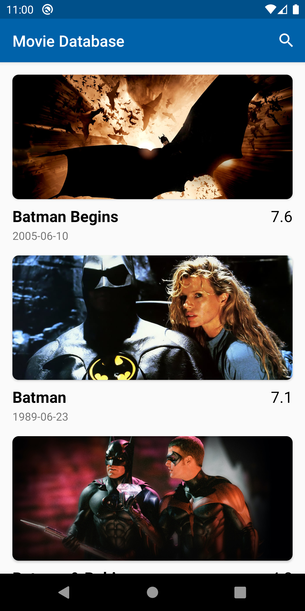

# Description
Programming challenge to create an Android app that allows a user to search and display movies from The Movie DB. 

The user will be able to enter their search query and, upon enter, the app will call the endpoint and collect the results to display. The app should display all entities in the list and be sorted in descending order of `vote_average` (9.0, 8.7, 8.5, etc).

The layout for displaying a movie should contain the following data: `backdrop_path` (image), `title`, `release_date`, and `vote_average`.

### API Documentation
[Search Movies](https://developers.themoviedb.org/3/search/search-movies)

Example: https://api.themoviedb.org/3/search/movie?api_key=c352da303cecea898250194bd5cc0dc5&query=batman

[Images](https://developers.themoviedb.org/3/getting-started/images)

Example: https://image.tmdb.org/t/p/original/9myrRcegWGGp24mpVfkD4zhUfhi.jpg

### API Key
`c352da303cecea898250194bd5cc0dc5`

