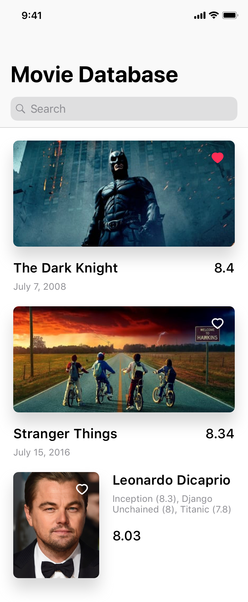

# movie-database
Requirements for a programming challenge on creating a simple app that displays actors.

# Overview
Programming challenge on creating a simple iOS app that displays movies, actors, and tv shows.

# Description
Create a single screen, iPhone app that allows a user to search for a movie, tv show, or actor and display the results.

Use The Movie Database API and the following the endpoint: /search/movie, /search/tv, /search/person.

The user will be able to enter their search query and, upon enter, the app will call each endpoint (movie, tv, person) and collect the results to display. The app must display all entities in the same list and it must be sorted in descending order by `vote_average` (9.0, 8.7, 8.5, etc). The Movie and TV entities contain the property `vote_average`, but the `vote_average` for a Person entity is a calculated value. The calculation is the average `vote_average` of all entities in the `known_for` array.

The layout for displaying a movie and tv show will be identical. Each contain `backdrop_path` (image), `title`, `release_date`, and `vote_average`. The layout for displaying a person will be slightly different and contains the following data: `profile_path` (image), `name`, list of `original_title` and `vote_average` in `known_for`, and the calculated value for `vote_average` (average of all `vote_average` in `known_for`).

The user will be able to favorite an entity by simply tapping on it. If the entity was previously a favorite, then the favorite is removed and vice versa.

The app must persist the last searched query and its results. If the app is completely killed, then, on a cold boot, 
it will display the search query in the search field and the entities marked as favorited or not.

### UI
Matching the exact design is not important; however the layout should be the same.

### API Key
`c352da303cecea898250194bd5cc0dc5`

### Documentation
[Search Movies](https://developers.themoviedb.org/3/search/search-movies)
[Search TV Shows](https://developers.themoviedb.org/3/search/search-tv-shows)
[Search People](https://developers.themoviedb.org/3/search/search-people)
[Images](https://developers.themoviedb.org/3/getting-started/images)
`https://image.tmdb.org/t/p/original/{image}`

# Feature Priority
- Search for entities against API
- Display entities
- Favorite entities
- Persist last results
- Persist last search term
- Persist favorites

# Bonus points
- Unit tests
- Pagination

# Submission
Once complete, submit a pull request against this repo.
